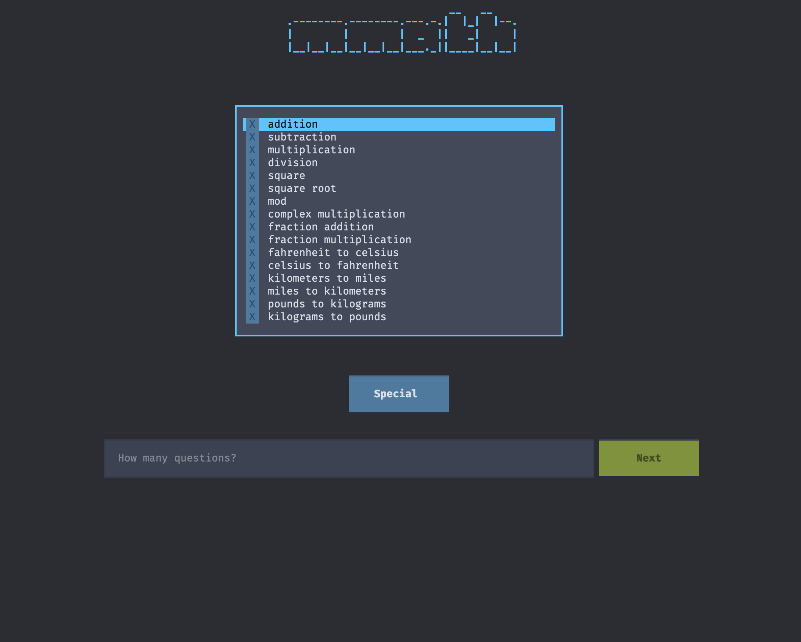
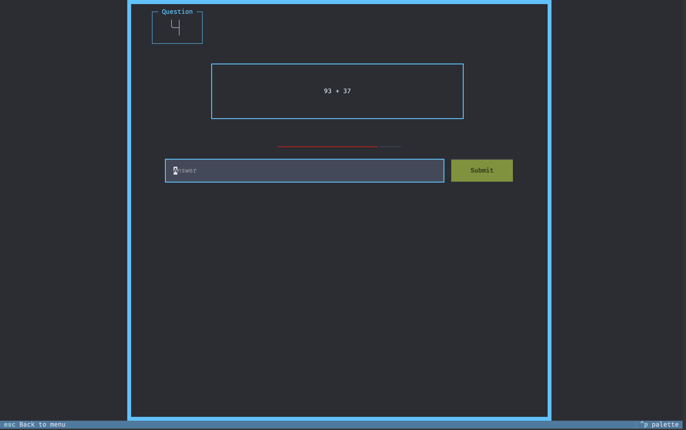
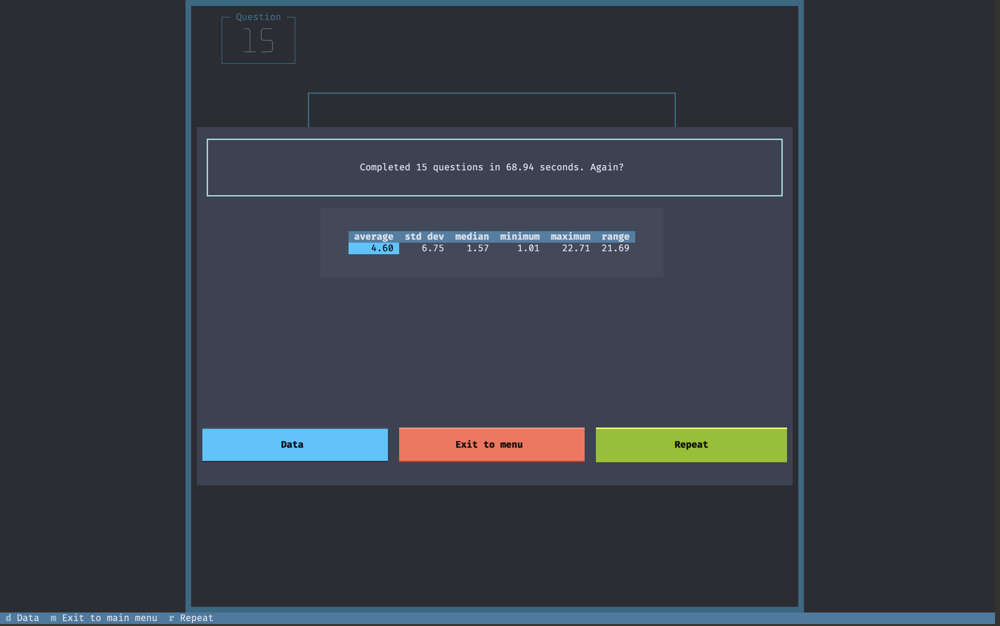
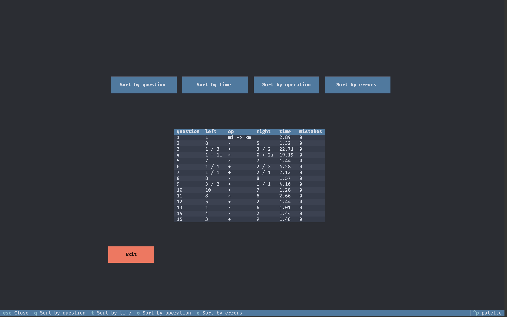

# mmath
A mental math training TUI application. Built with Python using the `textual` library.

## Features
- Covers many of the standard mental math challenges, including arithmetic, exponents, fractions, complex numbers, unit conversions, and day of the week questions.
- Supports quizzes with an arbitrary maximum number limit and number of questions.
- Options to set a limit on the time per question and make the question vanish after a specified period.
- Detailed data screen with options to question type, question time, or number of mistakes

## Guides
There are many resources available that detail methods to calculate quickly and accurately.
- <a href="https://worldmentalcalculation.com/advanced-calculation-methods/">World Mental Calculation</a>
- <a href="https://a.co/d/gnyceGX">Secrets of Mental Math,</a> by Arthur Benjamin and Michael Shermer

## Gallery
|   |   |
|------------------------------------|----------------------------------------|
| |   |

## Usage
Run `mmath` from the command line to start the application. Press `h` to view the help screen which details the options.

# Installation
With `uv`, run 
```
git clone https://github.com/kianbroderick/mmath.git
cd mmath
uv sync
uv run mmath
```
to clone and run the program.

# Future improvements
- add a screen to type in memorized digits of pi or e
- more operations
- add score tracking and statistics over multiple sessions

## License
`mmath` is lisensed under the terms of the MIT License.
